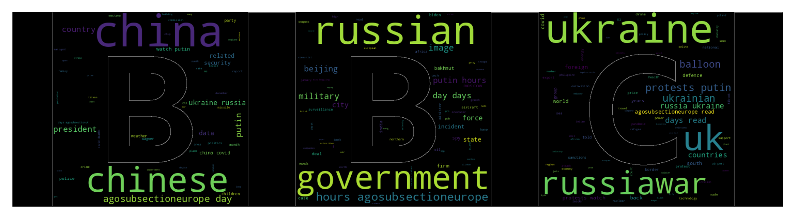
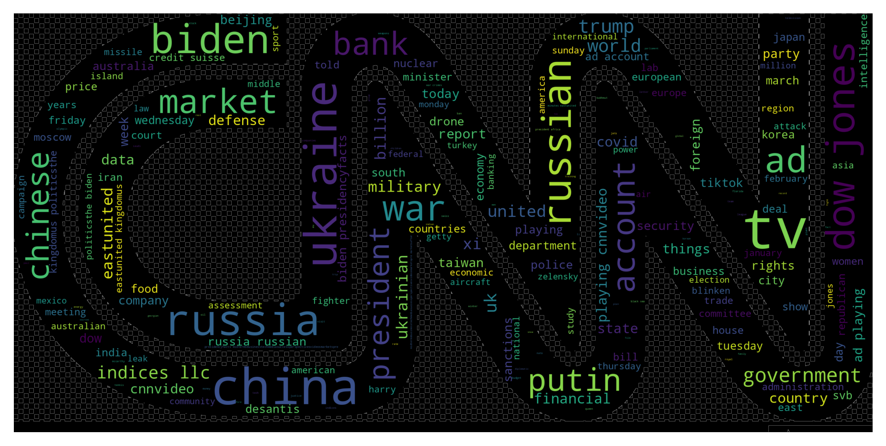
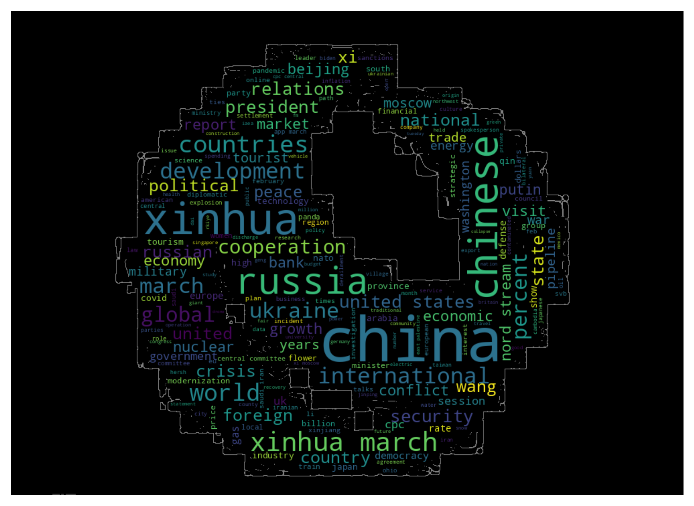
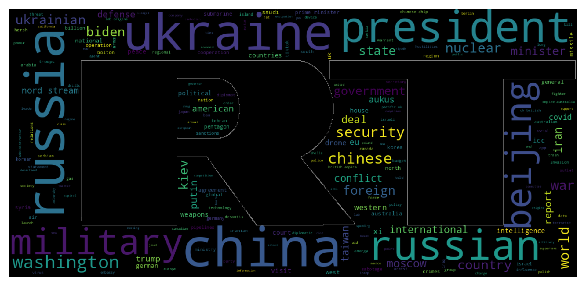
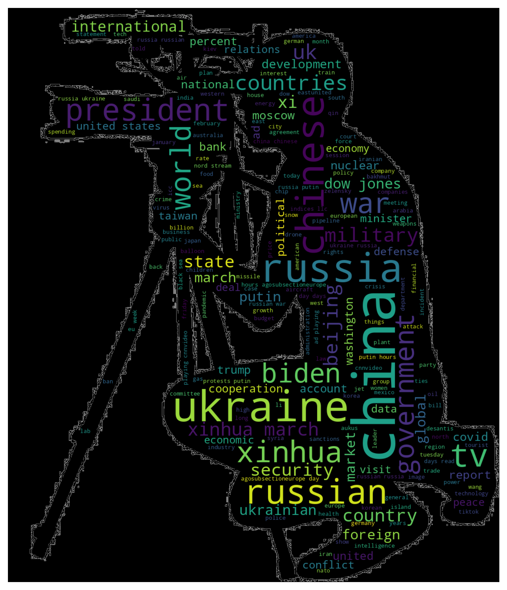

# Is any geopolitical influence on the press we read around the globe?
## Introduction

After the second world war and the falling of the "Nazi Empire", the world was divided by the Allies in two blocs: on one side, the Western bloc which included USA, UK , and, on the other side the Eastern bloc which included most of the communist countries at the time.

Just after this division,particulary noted in the city of Berlin, the tensions were raised in between both blocs; the creation of the NATO as a containment for the Soviet influence is considered the starting point of what was called the Cold War; as counterpart, the URSS created the Warsaw Pact in order the maintain the status quo.

Cold war was used to determine a period of history where, USA and URSS had an increasing geopolitical tension relationship without a straight confrontation, using nuclear arsenal development and conventional military deployment, psychological warfare, propaganda campaigns, espionage, far-reaching embargoes, rivalry at sports events, and technological competitions such as the Space Race.

On this atmosphere, it became crucial how messages are expressed, how to spread widely, and, most important thing, what is the purpose of them. For this reason, the press became a key point and a powerful tool for psychological warfare and propaganda campaigns. As 'Argumentum Ad Verecundiam' press has a relevant position in society, so, it's assumed what's pubblished it's true.

Ultimately, this relevance is the reason of the governments and private institutions interest to influence what they publish or what to ommit. One recent example can be, during the russian invasion of Ukraine, how the European Union considered press like RT or Sputnik agencies as misinforming mediums for the population and, for this reason they were banned to broadcast in Europe. As consequence of this decision during this project had to be implemented new features not contemplated at the beginning, as a VPN to "bypass" this prohibition, in order to find the way to get the information from this broadcast agency (RT) and evaluate if that was true, standarising some parameters and comparing them between the Western broadcast agencies.

## Methods
To analyse the influence that a government or an entity can provoke a partial news, we decided to take 4 different broadcast from different locations which can be meaningful in order to establish this relation.

In this particular case, we decided to use 2 sources from the west bloc (BBC,CNN) and two from the east bloc (RT, People's daily) with the idea to check also which one of both sides is more impartial reporting news. To trigger more significance, we checked the news published from the other bloc, in other words, we checked news on BCC and CNN about China and Russia, and vice versa (UK and USA in RT and P's D). To do so, 4 functions were created (one per website) to do webscrapping on each website with Selenium, getting each article content, title and date separed and formatted by day, month and year using BeautifulSoup library in Python. Once this information was obtained if was processed and save into a DF and then saved into a csv file with the format df_<broadcast>_<topic>.csv.

The following step was to analyse the information obtained. Witht his purpose, it was created another function which checked the subjectivity, polarity and the top 20 words most used in each article. As a result of a research about the Natural Language analysis, it's been decided to create a nomenclator of 'Stopwords', as the one provided by the NLTK library in python was not as accurate as the one used and, at the same time, the fact that a word considered meaningful, in the context analysed could be considered as 'Stopword' (i.e. news).

In this second step of the analysis process, it's been also transforming the data to have it ready for visualisation; in order to do it, the date of each article was compiled back again in the format dd/mm/yyyy, in addition two new columns were created: one was to introduce the source of the article and another one for the topic searched and resulted as the article mentioned in that row. The last step of this second stage was creating different DF's and save them into CSV's getting all the top 20 words of each broadcast agencies for, once more, being able to do some visualisation about it. The third step was the visualisation; on one side it was created a wordcloud with each agency's logo and a last one with a reporter's shape. On the other side, it was created a tableau story with all the graphs that were considered relevant for this analysis (see page Tableau).

Finally, the last step completed was implementing this data app; it was separed in 3 pages, one for the explanation, a second one for visualisation on tableau (embedding the story on the app) and a third one for filter. The purpose of this last page was to be able to check the news published in a certain day by title, source, topic, the subjectivity and polarity, as well as, including the top 20 most recurrent meaningful words in that article.

## Newspapers analysed
### BBC:
The British Broadcasting Corporation (BBC) is the national broadcaster of the United Kingdom, based at Broadcasting House in London, England. It is the world's oldest national broadcaster, and the largest broadcaster in the world by number of employees, employing over 22,000 staff in total, of whom approximately 19,000 are in public-sector broadcasting.The BBC is established under a royal charter and operates under its agreement with the Secretary of State for Culture, Media and Sport. From its inception, through the Second World War (where its broadcasts helped to unite the nation), to the popularisation of television in the post-WW2 era and the internet in the late 20th and early 21st centuries, the BBC has played a prominent role in British life and culture. (source: wikipedia)

" We're impartial and independent, and every day we create distinctive, world-class programmes and content which inform, educate and entertain millions of people in the UK and around the world. Our commercial operations including BBC Studios, the BBC's award-winning production company and world-class distributor, provide additional revenue for investment in new programming and services for UK audiences. The BBC's Board ensures that we deliver our mission and public purposes which are set out in the Charter. The Executive Committee is responsible for day-to-day management. Regulated by Ofcom." (source: own website)

### CNN:
CNN (Cable News Network) is a multinational news channel and website headquartered in Atlanta, Georgia, U.S.Founded in 1980 by American media proprietor Ted Turner and Reese Schonfeld as a 24-hour cable news channel, and presently owned by the Manhattan-based media conglomerate Warner Bros. CNN has been involved in various controversies, criticisms and allegations since its inception in 1980. The channel is known for its dramatic live coverage of breaking news, some of which has drawn criticism as overly sensationalistic. (source: wikipedia)

" We are truth-seekers and storytellers.We are journalists, designers and technologists, united by a mission to inform, engage and empower the world. We bear witness to history as it unfolds and explain not just what happened, but why, and what it means to you. Our products and platforms take you to the farthest corners of the world, and they bring the world to you, delivering content and services that enrich your lives, your families and your communities. We are available on more screens in more places than any other news source.We stand for excellence in our journalism and our products.We are committed to serving you."(source: own website)

### People's Daily Online:
The People's Daily (Chinese: 人民日报) is the official newspaper of the Central Committee of the Chinese Communist Party (CCP). Founded on Jan. 1, 1997, is a large-scale information interaction platform constructed by People's Daily -one of the world's top ten newspapers. It is also one of the largest comprehensive Internet media on the Internet. As a leading key news website in China, it upholds the belief 'authority and strength originate from the people". With "authority, popularity and credibility' as tenet, it takes 'multiple languages, all media forms, globalization and full coverage' as objectives, and 'disseminating China's news and covering world news' as its mission. On June 20, 2008, during his inspection tour of People.cn, President Hu Jintao said, 'People.cn has played a unique role in advocating the Party's belief, guiding public opinion and warmly serving netizens since inception.'(source: wikipedia-own website)

### RT:
RT (Russian: Россия Сегодня) is a Russian state-controlled international news television network funded by the Russian government. It operates pay television and free-to-air channels directed to audiences outside of Russia. RT has regularly been described as a major propaganda outlet for the Russian government and its foreign policy.Academics, fact-checkers, and news reporters (including some current and former RT reporters) have identified RT as a purveyor of disinformation and conspiracy theories. UK media regulator Ofcom has repeatedly found RT to have breached its rules on impartiality, including multiple instances in which RT broadcast 'materially misleading' content. (source: wikipedia)

"With its first international news channel launched in 2005, RT is now a global TV news network providing news, current affairs and documentaries in seven languages: English, Arabic, Spanish, French, German, Serbian and Russian, and sister multimedia news agency RUPTLY that provides livestreaming, video on demand, archive footage and broadcast services. RT creates news with an edge for viewers who want to Question More. RT covers stories overlooked by the mainstream media, provides alternative perspectives on current affairs, and acquaints international audiences with a Russian viewpoint on major global events.(source: own website)"

## Findings:
- Subjectivity:

As a result of this analysis, it can be noted an average of subjectivity by weeks oscillates around 0.35 (on a scale 0-1) which slightly higher in RT, which in week 5 of 2023, reach 0.4, being the second BBC in week 7 of 2023, with an average of 0.38, although, in general the subjectivity found has no significant difference in between them.
- Polarity:

In this case, it can be seen bigger discrepancies between the news agencies; on a scale from -1 to +1, none of them goes above/below 0.1, which means there's not much negativity/positivity inferred in the articles. Regardless, in this range of -0.1 to 0.1, we can underline the bigger discrepancies where, for example, RT, is the most negative one (actually, it's the one journal which falls below 0) and CNN the most positive (0.086).
- Number of publications by newspaper:

To analyse this parameter it needs to take in consideration the topics used; as the intention of this project is to check how geopolitics can cause an impact on their national newspapers, the amount of articles published are related with it; so, for example, BBC and CNN are counted by the articles published in relation of Russia and China, while, for RT and People's Daily the count is done about the articles published in relation of the United Kingdom and United States of America. As a result of this sum, it can be appreciated that, by far, CNN publishes more articles than the others about those topics.
- Recurrent topics: 

In this case, the analysis is focused on the topic resulting most recurrent, in other terms, what it's talked about more often; in this case, again, it has to be considered the fact of splitting the articles in two blocs: Russia/China vs. UK/USA. Considered this, it's observed that the highest amount of articles published by the western newspapers are about Russia, followed by USA.

- Most used words, difference in between the "two blocs"

East Bloc: Checking the graphs in tableau, it's clear that the most used word is China followed by United and States that, as a compound name, would be the second recurrent word in the eastern newspapers. It was also noted that the use of the term Ukraine, Russia and military are relevant words vs. war appears far lower times (39 times vs. military 79).

West Bloc: In this case China and Russia are the most frequent words used, as expected, followed closely by Ukraine. Also noted the term war is used more often (196 times). It appears also relevant, the amount of times the word Putin emerged(100 times vs 19 on the Easter bloc).

Overall of words: It's noted a massive significance of China as most recurrent in both blocs, followed by Ukraine, Russia, United and war. Also the relevance of this last word (war) is used more often than military overall.

## Conclusions:

The first and more relevant conclusion comes from the subjectivity analysis; as it was shown there's overall a significant subjectivity in all the newspapers, without having any outlier. This brings to question if the justitication by the European Union to ban RT to broadcast in this territory. On the other side, the Polarity of the articles the keep around 0, which means there messages transmitted are mostly neutral, slightly negative in RT or positive in the case of CNN but, without a great significance.

The use of words makes a key point in a news, that includes which word to use and what not to use. In this case it's seen how the Eastern Bloc keeps the use of war in a lower profile than military; this follows Vladimir Putin's speech of not being in wa with Ukraine, but, on a military operation to free the East territories in Ukraine. On the other side, it was avoided to use Ukraine as topic with the purpose to see how indirectly this term was appearing as a relation of another one and brings a relevant finding, which is, a high use of the Ukraine associated to any of the four countries used as topic, this bring to the conclusion the main international affair which links all the countries analysed is the war in Ukraine.

Finally it's remarkable the most topics published are Russia and USA, which brings back to the idea of a polarised world with two reference, which are those countries.

## Disclamer:

This project is being done with specific libraries and an adaptation of a MIT nomenclator, which, in between the availables, are the most reliable. Due to these reasons, the accuracy obtained can be as not precise as the reality; the fact of taking the words out of their context might infer in not accurate conclusions caused by the loss of meaning of the overall article.

